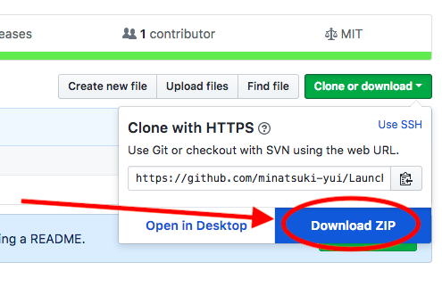
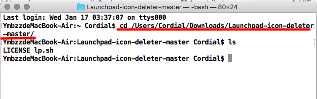
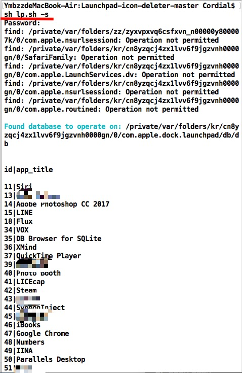
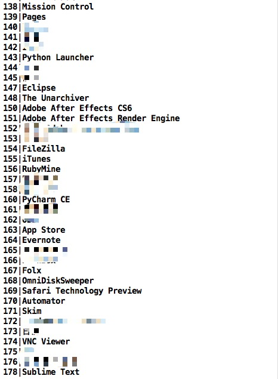
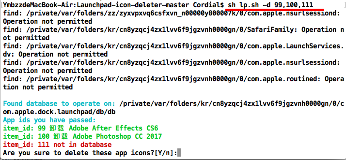

@@@@@@@@@@@@@@  
@ &nbsp; &nbsp; &nbsp; &nbsp; &nbsp; &nbsp; &nbsp;&nbsp; NOTE: &nbsp;&nbsp; &nbsp; &nbsp; &nbsp; &nbsp; &nbsp; &nbsp; &nbsp;@  
@ NOT OFFICAL SUPPORT&nbsp;@  
@@@@@@@@@@@@@@

<h2>What is this </h2>

A shell script to delete macOs  Launchpad icons

Inspired by https://www.jamf.com/jamf-nation/discussions/21946/removing-icons-from-launchpad-in-sierra

<h2>Test info </h2>

Tested on masOS High Sierra 10.13.1 (17B1003)

<h2>How to use </h2>

<h3>1. download  lp.sh  </h3> 

downlad zip and decompress it

<h3>2. open bash  </h3>
<h3>3. cd to directory  </h3>

<h3>4. sh lp.sh -s | --show  </h3>

> need enter password  

This will show apps which have icons in Launchpad
  
It would display something look like this:

...

<h3>4. sh lp.sh -d | --delete 99,100,111  </h3>

This will delete icons 

use `,` to pass multiple id parameters

<h3>5. enter y to confirm </h3>

Then Success

<h1>Thank you for use(´▽｀) </h1>

